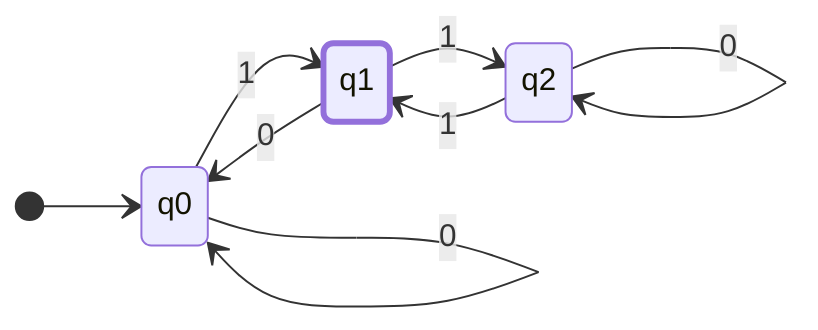
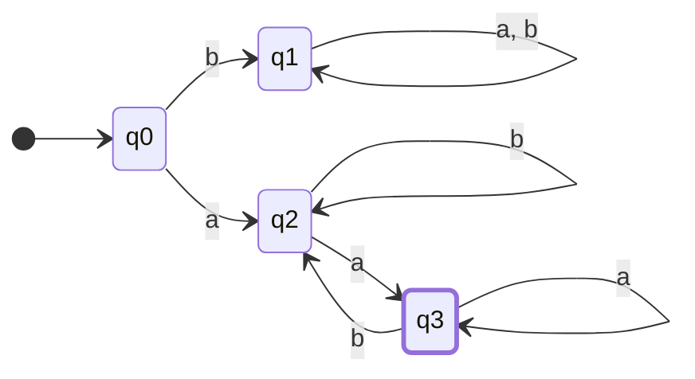

import LinkPreview from '../../../components/embeds/LinkPreview.astro'

It all started with a curiosity about regular expressions.\
I had been using them without much thought, until I wondered -- what exactly are they, and why are they universally supported across so many programming languages?

So I bought two books and decided to document what I learned.

<LinkPreview src="https://www.yes24.com/Product/Goods/24521492" />
<LinkPreview src="https://www.yes24.com/Product/Goods/95877099" />

# Where Did Regular Expressions Come From?

Before arriving at regular expressions, there was a primordial question:
> What is computation?

Before regular expressions were born, there were many attempts to find an answer to this question.
In the process, a field called "theory of computation" was born.

In the 1930s, Alan Turing devised the "Turing machine" to find an answer to this question.
[On Computable Numbers, with an Application to the Entscheidungsproblem](https://www.cs.virginia.edu/~robins/Turing_Paper_1936.pdf)
Through this paper -- "On Computable Numbers, with an Application to the Entscheidungsproblem" -- he proposed the Turing machine
and transformed the definition of "what can be computed" into the formalized concept of "what can be computed by a Turing machine."

I will leave the details of the Turing machine for you to explore on your own.

Time passed, and in the 1940s, Warren McCulloch and Walter Pitts proposed a "formal neuron" modeled after nerve cells.
[A Logical Calculus of the Ideas Immanent in Nervous Activity](https://www.cs.cmu.edu/~./epxing/Class/10715/reading/McCulloch.and.Pitts.pdf)
"A Logical Calculus of the Ideas Immanent in Nervous Activity"

If you have taken a machine learning course, you may have heard of the "perceptron."
The perceptron is a type of artificial neural network modeled after the formal neuron.
It has a structure that computes output values through input values, weights, and an activation function.

(diagram to be attached)

The formal neuron performs computation through logic gates. However, unlike the Turing machine, it cannot perform all computations.
The difference between the two lies in the memory domain.

The Turing machine has infinite memory through its tape, but the formal neuron has no memory.
So what kind of computation can be performed with a formal neuron that has no memory?

Time passed again, and in the 1950s, Stephen Kleene found the answer to this question.
[Representation of Events in Nerve Nets and Finite Automata](https://www.rand.org/content/dam/rand/pubs/research_memoranda/2008/RM704.pdf)
"Representation of Events in Nerve Nets and Finite Automata"

Through this paper, he proposed the notation called "Regular Expression," and demonstrated that what can be computed by formal neurons can be expressed with regular expressions.

Following regular expressions, he also proposed a "computational model" called the "finite automaton."

# Finite Automata (Finite Accepter)

Like the formal neuron with no memory, a finite automaton is a computational model without memory.
In other words, it is a computational model for things that can be computed without memory.

Put another way, it is a model that can perform computation without the need for memory.

Now let us learn about finite automata.

> About the finite accepter

A finite accepter is called "finite" because it has a finite number of states and no other storage beyond those states.\
It is also called an "accepter" because its outcome is either accept or reject.\
Among these, the deterministic finite accepter (DFA) is used for regular languages.

## Deterministic Finite Accepter (DFA) \_ Deterministic Finite Accepter

<aside>
A deterministic finite accepter **M** is defined as a quintuple (5-tuple).

$$M = (Q, \Sigma, \delta, q_0, F)$$

---

- Q : A finite set of **internal states**
- Sigma : A finite set of symbols, the **input alphabet**
- delta : Q x Sigma -> Q is a **total function**, called the **transition function**
- q0 in Q: The **initial state**
- F subset of Q : The set of **final (accepting) states**

</aside>

### How It Works

- We assume there is an initial state q_0.
- The input device is positioned at the leftmost symbol of the input string.
- At each move, the input device advances one position to the right (reading one symbol at a time).
- When the end is reached, if the automaton is in an accepting state, the string is accepted.
- Otherwise, it is rejected.
- Transitions are determined by the transition function delta.
- For example, if there is a transition delta(q_0, a) = q_1, and the DFA is in state q_0 with the current input symbol being a, it will transition to q_1.
- This is visually represented as a **transition graph**.
- Accepting states are represented by double circles.

Example 1

$$M = (\{q0, q1, q2\}, \{0,1\}, \delta,q_0,\{q_1\})$$

$$\delta(q_0,0)=q_0, \delta(q_0,1)=q1$$\
$$\delta(q_1,0)=q_0, \delta(q_1,1)=q2$$\
$$\delta(q_2,0)=q_2, \delta(q_2,1)=q1$$

This DFA accepts "01" but does not accept "11", "100", "1100", etc.

---

### Extended Transition Function

$$\delta^*={Q}\times{\Sigma^*}\to{Q}$$

The second argument of delta* is a string rather than a single symbol.\
Its value is the state the automaton ends up in after reading the entire given string.

$$\delta(q_0,a) = q_1 \text{ and } \delta(q_1, b)=q2 \text{ implies}$$ \
$$\delta^*(q_0,ab)=q_2.$$

## Languages and Deterministic Finite Accepters

A language is the set of all strings accepted by a given automaton.\
The language recognized by a DFA M is the set of all strings over Sigma that are accepted by M.

$$L(M) = \{w\in\Sigma^*:\delta^*(q_0,w)\in{F})$$

<aside>

1. **$${w\in\Sigma^*}$$**: This denotes the set of all strings w belonging to $$\Sigma^*$$. Here, Sigma is the input alphabet of the automaton, and Sigma* is the set of all possible strings that can be formed from Sigma. For example, if Sigma = {0,1}, then Sigma* is the set of all possible binary strings: "", "0", "1", "00", "01", "10", "11", "000", "001", ...
2. **$$\delta^*(q_0,w)\in F$$**: This indicates that the state the DFA ultimately reaches after reading string w belongs to the set of accepting states F. Here, delta* is the extended transition function, representing the state the automaton ends up in after starting from q_0 and reading string w.

Therefore, the full expression $$L(M) = {w\in\Sigma^*: \delta^*(q_0,w)\in F}$$ means "The language L(M) recognized by DFA M is the set of all strings w in Sigma* such that after reading w, M reaches an accepting state."
</aside>
The set of non-accepted strings:\
$$\overline{L(M)}=\{w\in\Sigma^*:\delta^*(q0,w)\notin{F}\}$$\
These are the elements among all possible strings that do not end up in a final accepting state.

## Regular Languages
Every finite automaton recognizes a specific language.\
A finite automaton works like a machine that recognizes a language. For example, one machine might only recognize the word "hello," while another might only recognize "good morning."\
If we consider all possible finite automata, we can obtain a collection of languages associated with them. Such a collection of languages is called a language family.\

The family of languages recognized by deterministic finite automata is extremely limited.
<aside>

A language L is called a regular language if and only if there exists a DFA M such that $$L = L(M)$$.\
In other words, a regular language is a language that can be perfectly recognized by a specific DFA.

As a simple example, if there is a DFA that recognizes "all words consisting only of 0s and 1s," then that language is a regular language. However, recognizing "only words made of 0s and 1s where the count of 0s and 1s are equal" is difficult with a simple DFA, so such a language may not be a regular language.
</aside>

#### Example) Show that L is a regular language

$$L =\{ awa: w \in \{a,b\}^*\}$$

$$\delta(q_0,a)=q_2$$\
$$\delta(q_0,b)=q_1$$\
$$\delta(q_2,b)=q_2$$\
$$\delta(q_2,a)=q_3$$\
$$\delta(q_3,b)=q_2$$\
$$\delta(q_3,a)=q_3$$\

The language L is the set of strings where w (belonging to $${a,b}$$) is surrounded by 'a' on both sides. This can be represented by the DFA shown above, and therefore it is a regular language.

### Cases That Are Not Regular Languages

1. **Palindrome Language**:
$$L1=\{w|w \text{ is a palindrome}\}$$
This language consists of strings that read the same forwards and backwards (palindromes). For example, "abba", "madam", "a", "aa" are included in this language, but "ab" and "abc" are not. It is impossible for a DFA alone to determine the exact midpoint and compare the reversed string.
2. **Pattern Matching Language**:
$$L2=\{a^nb^n|n\geq0\}$$
This language consists of strings where 'a' appears n times followed by 'b' appearing n times. For example, "ab", "aabb", "aaabbb" are included, but "aab", "aba", "aaabb" are not. This is because a DFA cannot count the exact number of 'a's and then verify the same number of 'b's.

<aside>
The DFA has no memory to remember the count of 'a's. To recognize this, an infinite number of states would be needed.
</aside>

3. **Repetition Language**:
$$L3=\{ww|w\in\{a,b\}^*\}$$
This is the set of strings where a string w is followed by an identical copy of w. For example, "aabbcc", "aabc", "bbb" are not included, but "aabaab", "aaa", "babbab" are included. It is difficult for a DFA to precisely identify and recognize the repeated portion of a string.

<aside>
The DFA cannot remember the input string w it has read so far. Therefore, it cannot determine whether the two halves are identical.
</aside>

> A DFA can only remember its current state; it cannot remember information about past inputs or future inputs.