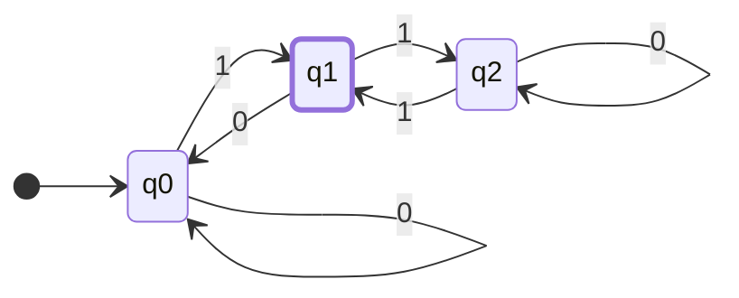
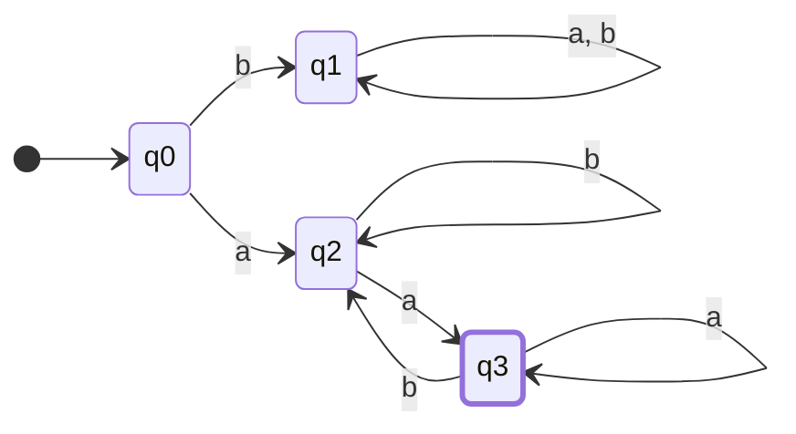

import LinkPreview from '../../../components/embeds/LinkPreview.astro'

きっかけは正規表現への素朴な疑問だった。\
何気なく使っていた正規表現とは一体何なのか？なぜ様々なプログラミング言語で共通して使われているのか？そんな疑問を抱いた。

そこで2冊の本を購入し、記録を残すことにした。

<LinkPreview src="https://www.yes24.com/Product/Goods/24521492" />
<LinkPreview src="https://www.yes24.com/Product/Goods/95877099" />

# 正規表現はどこから来たのか？

正規表現にたどり着く前に、根源的な問いがあった。
> 計算とは何か？

正規表現が生まれるまで、この問いに対する答えを探すための様々な試みがあった。
その過程で「計算理論」という分野が生まれた。

1930年代、アラン・チューリングはこの問いへの答えを見つけるために「チューリングマシン」を考案した。
[On Computable Numbers, with an Application to the Entscheidungsproblem](https://www.cs.virginia.edu/~robins/Turing_Paper_1936.pdf)
「計算可能な数について、決定問題（Entscheidungsproblem）への応用を含めて」という論文を通じて「チューリングマシン」を提案し、
「計算できるもの」という定義を「チューリングマシンで計算できるもの」という形式化された概念に置き換えた。

チューリングマシンについては各自で調べてみてほしい。

時は流れ1940年代、ウォーレン・マカロックとウォルター・ピッツが「神経細胞」をモデルとした「形式ニューロン」を提案した。
[A Logical Calculus of the Ideas Immanent in Nervous Activity](https://www.cs.cmu.edu/~./epxing/Class/10715/reading/McCulloch.and.Pitts.pdf)
「神経活動に内在するアイデアの論理的計算」

機械学習の講義で「パーセプトロン」について聞いたことがあるだろう。
パーセプトロンは「形式ニューロン」をモデルとした人工ニューラルネットワークの一種である。
入力値と重み、そして活性化関数を通じて出力値を計算する構造を持っている。

図表を添付予定

形式ニューロンは「論理ゲート」を通じて計算を行う。しかしチューリングマシンのようにすべての計算を実行することはできない。
この両者の間には記憶領域の違いがある。

チューリングマシンはテープを通じて無限のメモリを持っているが、形式ニューロンには記憶領域がない。
では、記憶領域のない形式ニューロンではどのような計算を実行できるのだろうか？

時はさらに流れ1950年代、スティーブン・クリーネがこの問いへの答えを見つけた。
[Representation of Events in Nerve Nets and Finite Automata](https://www.rand.org/content/dam/rand/pubs/research_memoranda/2008/RM704.pdf)
「神経網と有限オートマトンにおける事象の表現」

この論文を通じて「正規表現 Regular Expression」という表現を提案し、形式ニューロンで計算できるものは正規表現で表現できることを示した。

そして正規表現に続いて「有限オートマトン」という「計算モデル」を提案した。

# 有限オートマトン（finite accepter）

記憶領域のない形式ニューロンと同様に、有限オートマトンも記憶領域のない計算モデルである。
つまり、記憶領域なしに計算を実行できるものに対する計算モデルである。

言い換えれば、メモリ不要で計算を実行できるモデルと言える。

では、有限オートマトンについて見ていこう。

> 有限認識器（finite accepter）について説明

有限認識器は有限個の状態を持ち、それ以外の記憶装置を持たないため「有限」と呼ばれる。\
また、状態が承認（accept）か拒否（reject）であるため「認識器」とも呼ばれる。\
その中でも決定性有限認識器 DFA（deterministic finite accepter）は正規言語のために使用される。

## 決定性有限認識器 DFA \_ Deterministic Finite Accepter

<aside>
💡 決定性有限認識器 **M** は5つ組（quintuple）で定義される。

$$M = (Q, Σ, δ, q_0, F)$$

---

- Q : **内部状態（internal state）** の有限集合
- Σ : シンボルの有限集合、**入力アルファベット（input alphabet）**
- δ : Q × Σ → Q は **全域関数（total function）** であり、**遷移関数** と呼ぶ
- q0∈Q: **初期状態（initial state）**
- F⊆Q : **承認状態（final state）の集合**

</aside>

### 動作方式

- 初期状態 q_0 があると仮定する。
- 入力装置は入力文字列の最も左のシンボルに置かれている。
- オートマトンは毎回の移動ごとに、入力装置を1つ右に移動する。（1つずつ読み込む）
- 末端に到達したとき、オートマトンが承認状態にあれば、その文字列を承認（accept）する。
- そうでなければ拒否（reject）する。
- 遷移は遷移関数 δ に従って決定される。
- 例えば δ(q_0, a) = q_1 という遷移があり、DFA の状態が q_0 にあり、現在の入力シンボルが a の場合、q1 に遷移する。
- これを視覚的に表現したものが **遷移グラフ（transition graph）** である。
- 承認状態は二重丸で表現する。

例題 1

$$M = (\{q0, q1, q2\}, \{0,1\}, δ,q_0,\{q_1\})$$

$$δ(q_0,0)=q_0, δ(q_0,1)=q1$$\
$$δ(q_1,0)=q_0, δ(q_1,1)=q2$$\
$$δ(q_2,0)=q_2, δ(q_2,1)=q1$$

この DFA は 01 を承認するが、11、100、1100 などは承認しない。

---

### 拡張遷移関数（Extended Transition Function）

$$δ^*={Q}\times{Σ^*}\to{Q}$$

δ^* の第2引数は単一シンボルではなく文字列\
関数値はオートマトンが与えられた文字列をすべて読み終えた後に到達する状態

$$δ(q_0,a) = q_1 かつ δ(q_1, b)=q2 ならば$$ \
$$δ^*(q_0,ab)=q_2 である。$$

## 言語と決定性有限認識器

言語とは与えられたオートマトンによって承認されるすべての文字列の集合\
DFA M によって認識される言語とは、M によって承認される Σ に対するすべての文字列の集合

$$L(M) = \{w\inΣ^*:δ^*(q_0,w)\in{F})$$

<aside>

1. **$${w∈Σ^*}$$**: この部分は $$Σ^*$$ に属する `すべての文字列 w の集合` を意味します。ここで Σ はオートマトンの入力アルファベットであり、Σ^* は Σ から作れるすべての可能な文字列の集合を意味します。例えば、Σ = {0,1} の場合、Σ^* は "", "0", "1", "00", "01", "10", "11", "000", "001", ... などすべての可能なバイナリ文字列の集合です。
2. **$$δ^*(q_0,w)∈F$$**: この部分は `文字列 w` を読んだ後に DFA が `最終的に到達する状態` が `承認状態の集合 F` に属することを表します。ここで δ^* は拡張遷移関数で、q_0 から始まり文字列 w を読んだ後にオートマトンが到達する状態を表します。

したがって、全体の式 $$L(M) = {w∈Σ^*: δ^*(q_0,w)∈F}$$ は「DFA M が認識する言語 $$L(M)$$ は $$Σ^*$$ に属するすべての文字列 w のうち、w を読み終えた後に M が承認状態に到達するすべての文字列 w の集合」を意味します。
</aside>
承認されない集合\
$$\overline{L(M)}=\{w∈Σ^∗:δ^∗(q0,w)\notin{F}\}$$\
すべての文字列の集合のうち、最終承認状態に到達できない要素

## 正規言語
すべての有限オートマトンは特定の言語を認識する\
有限オートマトンはまるで言語を認識する機械のように動作する。例えば、ある機械は「こんにちは」という単語だけを認識でき、別の機械は「こんにちは、お元気ですか」だけを認識できるだろう。\
すべての可能な有限オートマトンを考えると、これらに関連する言語の集合を得ることができる。このような言語の集合を言語族（family）と呼ぶ。\

決定性有限オートマトンによって認識される言語族は極めて限定的である。
<aside>

💡 言語 L に対して $$L = L(M)$$ を満たす DFA M が存在し、かつその場合に限り、L を正規言語と呼ぶ。\
言い換えれば、正規言語とは特定の DFA で完全に認識できる言語のことである。

簡単な例を挙げると、「0と1だけで構成されたすべての単語」を認識する DFA があれば、その言語は正規言語です。しかし「0と1で構成された単語のうち、0と1の個数が等しい単語だけ」を認識するのは単純な DFA では困難なため、このような言語は正規言語ではない可能性があります。
</aside>

#### 例題）L が正規言語であることを示せ

$$L =\{ awa: w \in \{a,b\}^*\}$$

$$δ(q_0,a)=q_2$$\
$$δ(q_0,b)=q_1$$\
$$δ(q_2,b)=q_2$$\
$$δ(q_2,a)=q_3$$\
$$δ(q_3,b)=q_2$$\
$$δ(q_3,a)=q_3$$\

言語 L は $${a,b}$$ に属する w の前後に a が付く文字列の集合である。これは上記のような DFA で表現でき、そのため正規言語と言える。

### 正規言語ではない場合

1. **回文言語**:
$$L1={w|w は回文}$$
この言語は前から読んでも後ろから読んでも同じ文字列（回文・パリンドローム）で構成されています。例えば、"abba"、"madam"、"a"、"aa" などはこの言語に含まれますが、"ab"、"abc" は含まれません。DFA だけでは中間点を正確に見つけ出し、反転した文字列を比較することが不可能です。
2. **フォーマットマッチング言語**:
$$L2={a^nb^n|n≥0}$$
この言語は 'a' が n 回、その後に 'b' が n 回来る文字列で構成されます。例えば、"ab"、"aabb"、"aaabbb" などはこの言語に含まれますが、"aab"、"aba"、"aaabb" は含まれません。これは DFA が 'a' の正確な数を数え、その後に同じ数の 'b' を確認することが不可能だからです。

<aside>
👆 DFA は a の数を記憶しておくメモリがない。これを認識するには無限の数の状態が必要である。
</aside>

3. **反復言語**:
$$L3={ww|*∈{a,b}*}$$
文字列 w の後に同一の文字列 w が続く場合の集合です。例えば、"aabbcc"、"aabc"、"bbb" などは含まれませんが、"aabaab"、"aaa"、"babbab" は含まれます。DFA で文字列の反復部分を正確に把握し認識することは困難です。

<aside>
👆 DFA はこれまでに入力された文字列 w を記憶できない。そのため同一であると判断することができない。
</aside>

> DFA は現在の状態しか記憶できず、過去の入力や未来の入力に関する情報は記憶できない。
