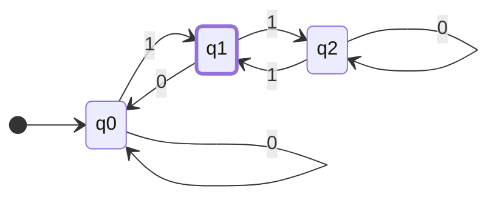

import { Mermaid } from "src/components/mermaid/mermaid-element";

# 유한 오토마타 (노션 -> mdx 마이그레이션중..)

> 유한 인식기(finite accepter) 에 대해서 설명

유한 개수의 상태를 가지며, 그 외의 다른 기억 장소를 가지지 않기 때문에 유한하다함

accept or reject 기 때문에 인식기

그중에서도 dfa(deterministic finite accepter) 정규 언어를 위해 사용된다.

## 결정적 유한 인식기 DFA \_ Deterministic Finite Accepter

<aside>
💡 결정적 유한 인식기 **M**은 5 원소 쌍(quintuple)로 정의된다.

$$M = (Q, Σ, δ, q_0, F)$$

---

- Q : **내부 상태(internal state)** 들의 유한 집합
- Σ : 심벌들의 유한 집합, **입력 알파벳(input alphabet)**
- δ : Q × Σ → Q는 **전체함수(total function)**이며, **전이 함수**라 부름
- q0∈Q: **초기 상태(initial state)**
- F⊆Q : **승인 상태(final state)들의 집합**

</aside>

### 동작 방식

- 초기 상태 q_0 가 있는 것으로 가정,
- 입력 장치는 입력 문자열의 가장 왼쪽 심벌에 놓여있다.
- 오토마타는 매 이동마다, 입력장치는 한 자리씩 오른쪽으로 이동. (하나씩 읽어온다)
- 맨 끝에 도달했을 때, 오토마타가 승인 상태에 있으면, 해당 문자열 승인
- 그렇지 않으면 거부
- 전이는 전이함수 δ에 따라 결정된다.
- 예를 들어 δ(q_0, a) = q_1라는 전이가 있고, dfa 상태가 q_0에 있고, 현재 입력 심벌이 a인 경우 q1으로 전이 할 것이다.
- 이를 가시적으로 표현 한 것이 **전이 그래프(transition graph)**
- 승인 상태는 이중원으로 표현한다.

예제 1

$$M = (\{q0, q1, q2\}, \{0,1\}, δ,q_0,\{q_1\})$$

$$δ(q_0,0)=q_0, δ(q_0,1)=q1$$
$$(q_1,0)=q_0, δ(q_1,1)=q2$$
$$δ(q_2,0)=q_2, δ(q_2,1)=q1$$

$$δ:{Q}\times ({Σ} \cup \{\lambda\}) \to 2^{Q}$$

이 DFA는 01은 승인하지만, 11, 100, 1100 등은 승인 하지 않는다.

---
