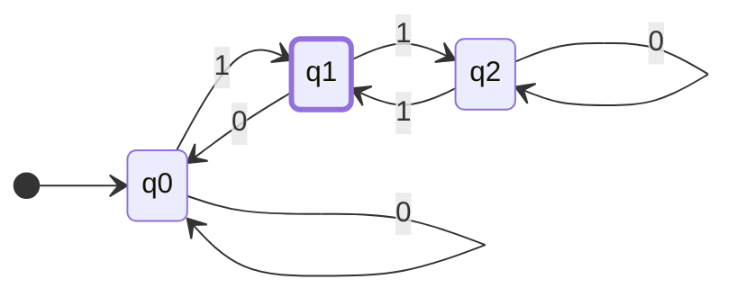
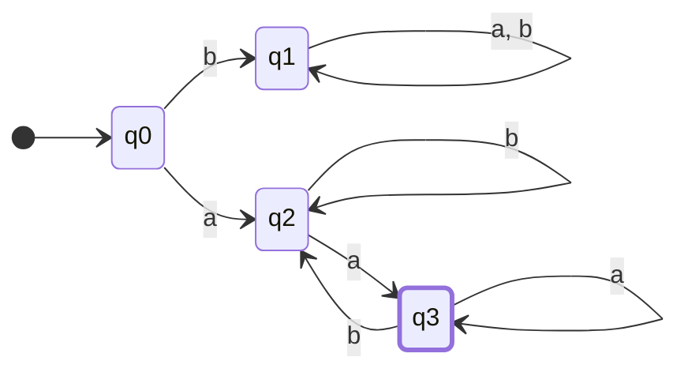

import LinkPreview from '../../components/LinkPreview.astro'

시작은 정규표현식에 대한 궁금증에서 시작된다.\
정규표현식을 크나큰 생각없이 사용하다가, 이게 무엇이길래? 여러 언어들에서 통용되고 있는것일까? 라는 생각이 들었다.\

그래서 두권의 책을 구매하고, 기록을 남기기로 했다.

<LinkPreview src="https://www.yes24.com/Product/Goods/24521492" />
<LinkPreview src="https://www.yes24.com/Product/Goods/95877099" />

# 유한 오토마타(finite accepter)

> 유한 인식기(finite accepter) 에 대해서 설명

유한 인식기는 유한 개수의 상태를 가지며, 그 외의 다른 기억 장소를 가지지 않기 때문에 유한하다고 한다.\
또한 상태가 승인(accept) 아니면 거부(reject) 이기 때문에 인식기라고도 한다.\
그중에서도 결정적 유한 인식기 dfa(deterministic finite accepter)는 정규 언어를 위해 사용된다.

## 결정적 유한 인식기 DFA \_ Deterministic Finite Accepter

<aside>
💡 결정적 유한 인식기 **M**은 5 원소 쌍(quintuple)로 정의된다.

$$M = (Q, Σ, δ, q_0, F)$$

---

- Q : **내부 상태(internal state)** 들의 유한 집합
- Σ : 심벌들의 유한 집합, **입력 알파벳(input alphabet)**
- δ : Q × Σ → Q는 **전체함수(total function)**이며, **전이 함수**라 부름
- q0∈Q: **초기 상태(initial state)**
- F⊆Q : **승인 상태(final state)들의 집합**

</aside>

### 동작 방식

- 초기 상태 q_0 가 있는 것으로 가정,
- 입력 장치는 입력 문자열의 가장 왼쪽 심벌에 놓여있다.
- 오토마타는 매 이동마다, 입력장치는 한 자리씩 오른쪽으로 이동. (하나씩 읽어온다)
- 맨 끝에 도달했을 때, 오토마타가 승인 상태에 있으면, 해당 문자열 승인(accept)
- 그렇지 않으면 거부(reject)
- 전이는 전이함수 δ에 따라 결정된다.
- 예를 들어 δ(q_0, a) = q_1라는 전이가 있고, dfa 상태가 q_0에 있고, 현재 입력 심벌이 a인 경우 q1으로 전이 할 것이다.
- 이를 가시적으로 표현 한 것이 **전이 그래프(transition graph)**
- 승인 상태는 이중원으로 표현한다.

예제 1

$$M = (\{q0, q1, q2\}, \{0,1\}, δ,q_0,\{q_1\})$$

$$δ(q_0,0)=q_0, δ(q_0,1)=q1$$\
$$δ(q_1,0)=q_0, δ(q_1,1)=q2$$\
$$δ(q_2,0)=q_2, δ(q_2,1)=q1$$

이 DFA는 01은 승인하지만, 11, 100, 1100 등은 승인 하지 않는다.

---

### 확장 전이 함수 (Extended Transition Function)

$$δ^*={Q}\times{Σ^*}\to{Q}$$

δ^* 의 두번째 인수는 단일 심벌이 아닌 문자열\
함수 값은 오토마타가 주어진 문자열을 모두 읽은 후에 놓이게 되는 상태

$$δ(q_0,a) = q_1 이고 δ(q_1, b)=q2이면$$ \
$$δ^*(q_0,ab)=q_2이다.$$

## 언어와 결정적 유한 인식기

언어란 주어진 오토마타에 의해서 승인되는 모든 문자열 집합 \
DFA M에 의해 인식되는 언어란, M에 의해 승인되는 Σ에 대한 모든 문자열의 집합

$$L(M) = \{w\inΣ^*:δ^*(q_0,w)\in{F})$$

<aside>

1. **$${w∈Σ^*}$$**: 이 부분은 $$Σ^*$$에 속하는 `모든 문자열 w의 집합`을 의미합니다. 여기서 Σ는 오토마타의 입력 알파벳이고, Σ^*는 Σ에서 만들 수 있는 모든 가능한 문자열들의 집합을 의미합니다. 예를 들어, 만약 Σ = {0,1}이라면, Σ^*는 "", "0", "1", "00", "01", "10", "11", "000", "001", ... 등 모든 가능한 이진 문자열들의 집합
2. **$$δ^*(q_0,w)∈F$$**: 이 부분은 `문자열 w`를 읽은 후에 DFA가 `최종적으로 도달하는 상태`가 `승인 상태 집합 F`에 속한다는 것을 나타냅니다. 여기서 δ^*는 확장 전이 함수로, q_0에서 시작해서 문자열 w를 읽은 후에 오토마타가 놓이게 되는 상태를 나타냅니다.

따라서, 전체 식 $$L(M) = {w∈Σ^*: δ^*(q_0,w)∈F}$$는 "DFA M이 인식하는 언어 $$L(M)는 Σ^*$$에 속하는 모든 문자열 w 중에서, w를 읽고 나서 M이 승인 상태에 도달하는 모든 문자열 w의 집합"을 의미합니다.
</aside>
승인되지 않는 집합\
$$\overline{L(M)}=\{w∈Σ^∗:δ^∗(q0,w)\notin{F}\}$$\
모든 문자열 집합중에서 최종 승인상태에 속하지 못하는 요소들

## 정규언어
모든 유한 오토마타는 특정 언어를 인식 \
유한 오토마타는 마치 언어를 인식하는 기계처럼 작동합니다. 예를 들어, 어떤 기계는 "안녕"이라는 단어만 인식할 수 있을 것이고, 다른 기계는 "안녕하세요"만을 인식할 수 있을 것\
모든 가능한 유한 오토마타들을 고려해보면 이들과 관련된 언어들의 집합을 얻을 수 있음. 이러한 언어의 집합을 언어군(family)라고 부른다.\

결정적 유한 오토마타에 의해 인식되는 언어군은 극히 제한적.
<aside>

💡 언어 L에 대해서 $$L = L(M)$$을 만족하는 DFA M 이 존재하고 오직 그럴 때에만 L을 정규 언어 라고 부른다.\
다시 말해, 정규언어란 특정 DFA로 완벽하게 인식될 수 있는 언어.

간단한 예를 들면, '0과 1로만 이루어진 모든 단어들'을 인식하는 DFA가 있다면, 그 언어는 정규 언어입니다. 하지만 '0과 1로 이루어진 단어 중에서 0과 1의 개수가 같은 단어만'을 인식하는 것은 단순한 DFA로는 어렵기 때문에, 이런 언어는 정규 언어가 아닐 수 있습니다.
</aside>

#### 예제)  L이 정규언어임을 보여라

$$L =\{ awa: w \in \{a,b\}^*\}$$

$$δ(q_0,a)=q_2$$\
$$δ(q_0,b)=q_1$$\
$$δ(q_2,b)=q_2$$\
$$δ(q_2,a)=q_3$$\
$$δ(q_3,b)=q_2$$\
$$δ(q_3,a)=q_3$$\

언어 L은 $${a,b}$$에 속하는 w 앞뒤로 a가 오는 문자열의 집합이다. 이는 위와 같은 DFA로 표현되며 그렇기에 정규언어라고 할 수 있다.

### 정규언어가 아닌 경우

1. **팔린드롬 언어**:
$$L1={w|w는 팔린드롬}$$
이 언어는 앞에서 읽으나 뒤에서 읽으나 같은 문자열(팔린드롬)로 구성되어 있습니다. 예를 들어, "abba", "madam", "a", "aa" 등은 이 언어에 포함되지만 "ab", "abc"는 포함되지 않습니다. DFA만으로는 중간 지점을 정확히 알아내고 뒤집힌 문자열을 비교하는 것이 불가능합니다.
2. **포맷 매칭 언어**:
$$L2={a^nb^n|n≥0}$$
이 언어는 'a'가 n번, 그 다음에 'b'가 n번 오는 문자열들로 구성됩니다. 예를 들어, "ab", "aabb", "aaabbb" 등은 이 언어에 포함되지만, "aab", "aba", "aaabb"는 포함되지 않습니다. 이는 DFA가 'a'의 정확한 수를 세고, 그 다음에 같은 수의 'b'를 확인하는 것이 불가능하기 때문입니다.
    
<aside>
👆 DFA는 a의 수를 기억 하고 있을 메모리가 없다. 이를 인식 하기 위해선 무한한 수의 상태가 필요하다.
</aside>
    
3. **반대 언어**:
$$L3={ww|*∈{a,b}*}$$
문자열 w 뒤에 동일한 문자열 w가 오는 경우의 집합입니다. 예를 들어, "aabbcc", "aabc", "bbb" 등은 포함되지 않지만 "aabaab", "aaa", "babbab"는 포함됩니다. DFA로 문자열의 반복 부분을 정확하게 파악하고 인식하는 것은 어렵습니다.
    
<aside>
👆 DFA 는 지금까지 입력받은 문자열 w를 기억 할 수 없다. 그렇기에 동일하다고 판단 할 수 없다.
</aside>
    

> DFA는 현재 상태만 기억할 수 있고, 과거 입력이나 미래 입력에 대한 정보는 기억할 수 없다.