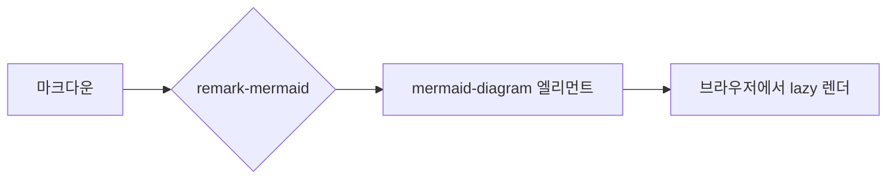

{/*
  /design 레퍼런스 페이지의 본문 샘플.
  언더스코어 파일이라 라우트가 생기지 않으며, design/index.astro에서 직접 import 된다.
  astro.config.mjs 의 markdown 설정(remark-math → KaTeX, mermaid 치환, Shiki 커스텀 테마)을
  실제 블로그 글과 동일하게 통과한다.
*/}

## 헤딩 2 — 섹션 제목

본문 문단입니다. 마크다운 본문의 기본 타이포그래피는 Pretendard로 렌더링되며, `prose prose-black` 래퍼(ArticleProse.astro)의 영향을 받습니다. [링크는 이렇게](/blog) 밑줄과 `decoration-black/15`로 표시되고, **강조 텍스트**와 *기울임*, 그리고 `인라인 코드`가 함께 쓰입니다.

### 헤딩 3 — 하위 섹션

짧은 문단. 아래는 중첩 리스트입니다.

- 순서 없는 리스트 첫 항목
- 두 번째 항목
  - 중첩된 항목
  - 중첩된 항목 둘
- 세 번째 항목

1. 순서 있는 리스트
2. 두 번째 단계
3. 세 번째 단계

#### 헤딩 4 — 세부 항목

> 인용문입니다. 블로그 글 36곳에서 쓰이는 blockquote 스타일.
> 여러 줄로 이어질 때의 모습도 함께 확인합니다.

<aside>
콜아웃(aside)입니다. 글 48곳에서 쓰이는 이 블로그의 사실상 유일한 콜아웃 시스템 — 헤어라인 박스 (global.css `article aside`).
</aside>

---

## 코드

인라인 코드는 `bg-zinc-100`, 코드 블록은 Shiki 커스텀 테마(github-dark-default)로 렌더링됩니다.

```typescript
type Post = {
  title: string;
  date: Date;
  categories?: string[];
};

const readingTime = (body: string) =>
  Math.ceil(body.replace(/<[^>]+>/g, "").split(/\s+/).length / 200);
```

긴 줄이 있는 코드 블록 — 가로 스크롤 시 blur-fade 마스크(at-start/at-end 클래스)가 동작하는지 확인용:

```typescript
const veryLongLine = someFunction(firstArgument, secondArgument, thirdArgument, fourthArgument, fifthArgument, { option: true, anotherOption: "value", yetAnotherOption: 42 });
```

## 수식 (KaTeX)

인라인 수식 $e^{i\pi} + 1 = 0$ 과 블록 수식:

$$
\int_{-\infty}^{\infty} e^{-x^2} \, dx = \sqrt{\pi}
$$

## 다이어그램 (Mermaid)



## 표

| 카테고리 | 의미 | 예시 |
|---------|------|------|
| `react` | React 생태계 | hooks, compiler |
| `javascript` | JS 언어/런타임 | V8, 라이브러리 분석 |
| `essay` | 에세이/회고 | 여행, 서평 |

## 이미지

<figure><figcaption>figure + img + figcaption — 글 69곳에서 쓰이는 이미지 패턴. 클릭하면 라이트박스.</figcaption></figure>

## 접기 (details)

<details>
<summary>접힌 콘텐츠 제목</summary>

details/summary 스타일은 global.css에 전역 정의되어 있습니다 (`::details-content` 트랜지션 포함). 펼쳤을 때 이 내용이 보입니다.

</details>
