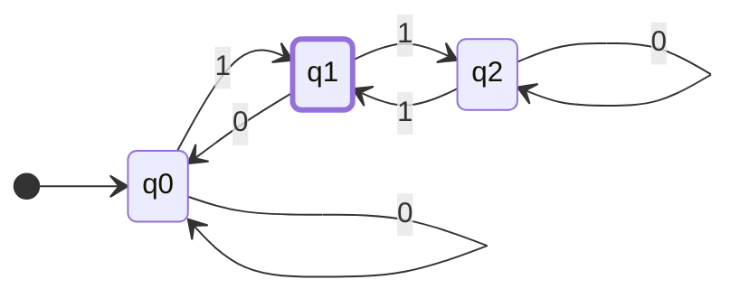
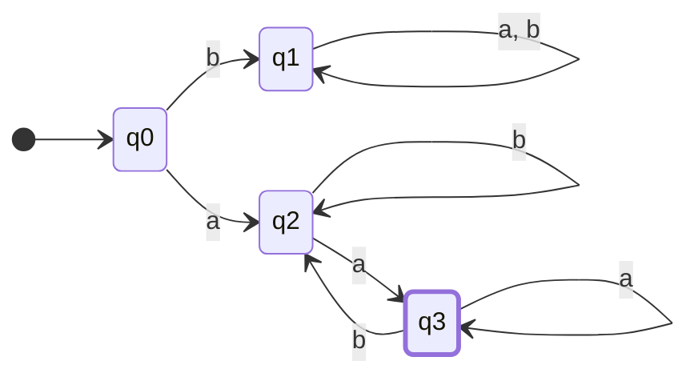
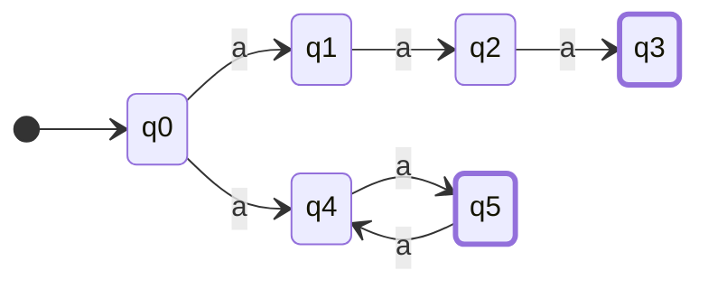
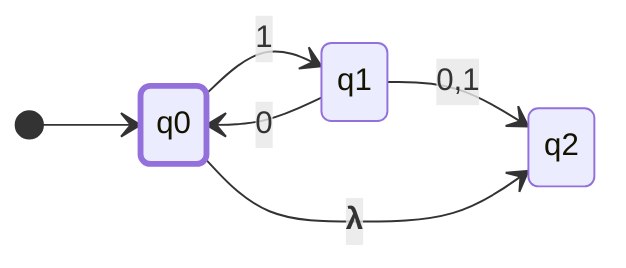
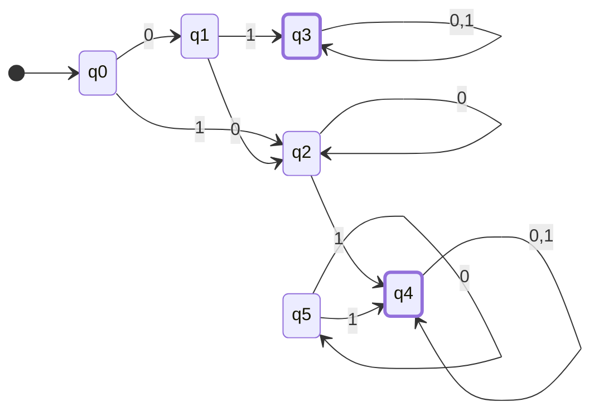
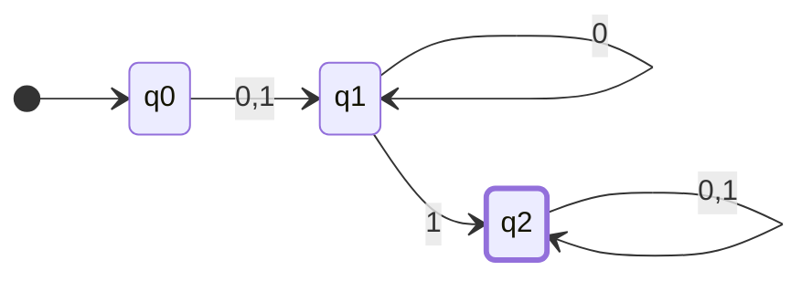
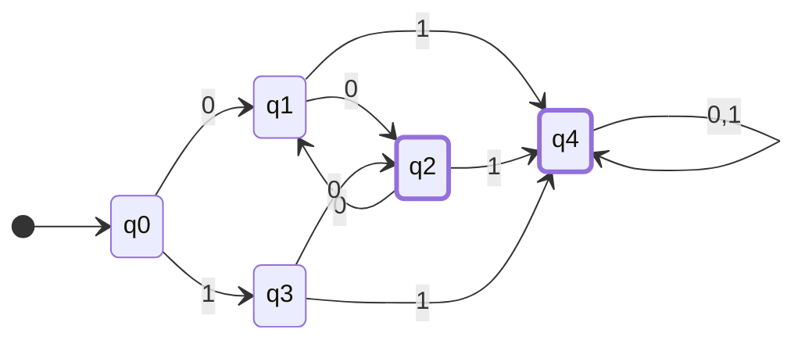

# 유한 오토마타

> 유한 인식기(finite accepter) 에 대해서 설명
> 

유한 개수의 상태를 가지며, 그 외의 다른 기억 장소를 가지지 않기 때문에 유한하다함

accept or reject 기 때문에 인식기

그중에서도 dfa(deterministic finite accepter)  정규 언어를 위해 사용된다.

## 결정적 유한 인식기 DFA _ Deterministic Finite  Accepter

<aside>
💡 결정적 유한 인식기 **M**은 5 원소 쌍(quintuple)로 정의된다.

$$
M = (Q, Σ, δ, q_0, F)
$$

---

- Q : **내부 상태(internal state)** 들의 유한 집합
- Σ : 심벌들의 유한 집합, **입력 알파벳(input alphabet)**
- δ : Q × Σ → Q는 **전체함수(total function)**이며,  **전이 함수**라 부름
- q0∈Q: **초기 상태(initial state)**
- F⊆Q : **승인 상태(final state)들의 집합**
</aside>

### 동작 방식

- 초기 상태 q_0  가 있는 것으로 가정,
- 입력 장치는 입력 문자열의 가장 왼쪽 심벌에 놓여있다.
- 오토마타는 매 이동마다, 입력장치는 한 자리씩  오른쪽으로 이동. (하나씩 읽어온다)
- 맨 끝에 도달했을 때, 오토마타가 승인 상태에 있으면, 해당 문자열 승인
- 그렇지 않으면 거부
- 전이는 전이함수 δ에 따라 결정된다.
- 예를 들어 δ(q_0, a) = q_1라는 전이가 있고, dfa 상태가 q_0에 있고, 현재 입력 심벌이 a인 경우 q1으로 전이 할 것이다.
- 이를 가시적으로 표현 한 것이 **전이 그래프(transition graph)**
- 승인 상태는 이중원으로 표현한다.

예제 1

$$
M = (\{q0, q1, q2\}, \{0,1\}, δ,q_0,\{q_1\})
$$

$$
δ(q_0,0)=q_0, δ(q_0,1)=q1\\
δ(q_1,0)=q_0, δ(q_1,1)=q2\\
δ(q_2,0)=q_2, δ(q_2,1)=q1\\

$$

이  DFA는 01은 승인하지만, 11, 100, 1100 등은 승인 하지 않는다.

---

### 확장 전이 함수 (extended transition function)

$$
δ^*={Q}\times{Σ^*}\to{Q}
$$

δ^* 의 두번째 인수는 단일 심벌이 아닌 문자열

함수 값은 오토마타가 주어진 문자열을 모두 읽은 후에 놓이게 되는 상태

$$
δ(q_0,a) = q_1 이고 δ(q_1, b)=q2이면\\
δ^*(q_0,ab)=q_2이다.
$$

증명은 일단 생략하자..

## 언어와 결정적 유한 인식기

언어란 주어진 오토마타에 의해서 승인되는 모든 문자열 집합

DFA M에 의해 인식되는 언어란, M에 의해 승인되는 Σ에 대한 모든 문자열의 집합

$$
L(M) = \{w\inΣ^*:δ^*(q_0,w)\in{F})
$$

<aside>
💡

1. **{w∈Σ^*}**: 이 부분은 `Σ^*`에 속하는 `모든 문자열 w의 집합`을 의미합니다. 여기서 Σ는 오토마타의 입력 알파벳이고, Σ^*는 Σ에서 만들 수 있는 모든 가능한 문자열들의 집합을 의미합니다. 예를 들어, 만약 Σ = {0,1}이라면, Σ^*는 "", "0", "1", "00", "01", "10", "11", "000", "001", ... 등 모든 가능한 이진 문자열들의 집합
2. **δ^*(q_0,w)∈F**: 이 부분은 `문자열 w`를 읽은 후에 DFA가 `최종적으로 도달하는 상태`가 `승인 상태 집합 F`에 속한다는 것을 나타냅니다. 여기서 δ^*는 확장 전이 함수로, q_0에서 시작해서 문자열 w를 읽은 후에 오토마타가 놓이게 되는 상태를 나타냅니다.

따라서, 전체 식 L(M) = {w∈Σ^*: δ^*(q_0,w)∈F}는 "DFA M이 인식하는 언어 L(M)는 Σ^*에 속하는 모든 문자열 w 중에서, w를 읽고 나서 M이 승인 상태에 도달하는 모든 문자열 w의 집합"을 의미합니다.

</aside>

승인되지 않는 집합

$$
\overline{L(M)}=\{w∈Σ^∗:δ^∗(q0,w)\notin{F}\}
$$

모든 문자열 집합중에서 최종 승인상태에 속하지 못하는 요소들

## 정규언어

모든 유한 오토마타는 특정 언어를 인식 
유한 오토마타는 마치 언어를 인식하는 기계처럼 작동합니다. 예를 들어, 어떤 기계는 "안녕"이라는 단어만 인식할 수 있을 것이고, 다른 기계는 "안녕하세요"만을 인식할 수 있을 것

모든 가능한 유한 오토마타들을 고려해보면 이들과 관련된 언어들의 집합을 얻을 수 있음. 이러한 언어의 집합을 언어군(family)라고 부른다. 

결정적 유한 오토마타에 의해 인식되는 언어군은 극히 제한적.

<aside>
💡 언어 L에 대해서 L = L(M)을 만족하는 DFA M 이 존재하고 오직 그럴 때에만 L을 정규 언어 라고 부른다.

다시 말해, 정규언어란 특정 DFA로 완벽하게 인식될 수 있는 언어.

---

간단한 예를 들면, '0과 1로만 이루어진 모든 단어들'을 인식하는 DFA가 있다면, 그 언어는 정규 언어입니다. 하지만 '0과 1로 이루어진 단어 중에서 0과 1의 개수가 같은 단어만'을 인식하는 것은 단순한 DFA로는 어렵기 때문에, 이런 언어는 정규 언어가 아닐 수 있습니다.

</aside>

### 예제  L이 정규언어임을 보여라

$$
L =\{ awa: w \in \{a,b\}^*\}
$$

$$
δ(q_0,a)=q_2\\
δ(q_0,b)=q_1\\
δ(q_2,b)=q_2\\
δ(q_2,a)=q_3\\
δ(q_3,b)=q_2\\
δ(q_3,a)=q_3\\

$$

언어 L은 {a,b}에 속하는 w 앞뒤로 a가 오는 문자열의 집합이다. 이는 위와 같은 DFA로 표현되며 그렇기에 정규언어라고 할 수 있다.

### 정규언어가 아닌 경우

1. **팔린드롬 언어**:
*L*1={*w*∣*w*는 팔린드롬}
이 언어는 앞에서 읽으나 뒤에서 읽으나 같은 문자열(팔린드롬)로 구성되어 있습니다. 예를 들어, "abba", "madam", "a", "aa" 등은 이 언어에 포함되지만 "ab", "abc"는 포함되지 않습니다. DFA만으로는 중간 지점을 정확히 알아내고 뒤집힌 문자열을 비교하는 것이 불가능합니다.
2. **포맷 매칭 언어**:
*L*2={*a^nb^n*∣*n*≥0}
이 언어는 'a'가 n번, 그 다음에 'b'가 n번 오는 문자열들로 구성됩니다. 예를 들어, "ab", "aabb", "aaabbb" 등은 이 언어에 포함되지만, "aab", "aba", "aaabb"는 포함되지 않습니다. 이는 DFA가 'a'의 정확한 수를 세고, 그 다음에 같은 수의 'b'를 확인하는 것이 불가능하기 때문입니다.
    
    <aside>
    ☝ DFA는 a의 수를 기억 하고 있을 메모리가 없다. 이를 인식 하기 위해선 무한한 수의 상태가 필요하다.
    
    </aside>
    
3. **반대 언어**:
*L*3={*ww*∣*w*∈{*a*,*b*}∗}
문자열 w 뒤에 동일한 문자열 w가 오는 경우의 집합입니다. 예를 들어, "aabbcc", "aabc", "bbb" 등은 포함되지 않지만 "aabaab", "aaa", "babbab"는 포함됩니다. DFA로 문자열의 반복 부분을 정확하게 파악하고 인식하는 것은 어렵습니다.
    
    <aside>
    ☝ DFA 는 지금까지 입력받은 문자열 w를 기억 할 수 없다. 그렇기에 동일하다고 판단 할 수 없다.
    
    </aside>
    

> DFA는 현재 상태만 기억할 수 있고, 과거 입력이나 미래 입력에 대한 정보는 기억할 수 없다.
> 

## 비결정적 유한 인식기

여태 봐온 것들은, 각 상태에서 입력 심벌이 주어질 경우 하나의 전이만 가능한 경우였다. 그렇기에 결정적이라고 불렀다. 

### 정의

오토마타가 이동에 있어서 선택 할 수 있음을 의미한다. 가능한 여러가지 이동에 대한 집합을 허용하는 것.

전이 함수가 상태들의 집합을 치역(range)로 갖게 함으로써 가능해진다.

<aside>
📎 비결정적 유한 인식기(nondeterministic finite accepter) NFA 는 다섯 원소 쌍으로 정의된다.

$$
M = (Q, Σ, δ, q_0, F)
$$

---

Q, Σ, q_0, F 는 DFA 와 같이 정의 되고, δ만 다르게 정의된다.

$$
δ:{Q}\times ({Σ} \cup \{\lambda\}) \to 2^{Q}
$$

</aside>

DFA와 차이점

- δ의 치역은 멱집합 2^Q내에 있으며, 따라서 그 값이 Q의 단일 원소가 아닌 Q의 부분집합이 된다. 예를 들어
    
    $$
    δ(q_1,a)= \{q_0, q_2\}
    $$
    
- 전이함수 δ의 두번째 인수로 **λ**를 허용. 이는 입력 심벌을 읽지 않고도 상태 전이가 가능함을 의미. 입력 포인터가 머물러 있는 것이 가능.
- δ(q_i,a)가 공집합 일 수 있다. 특정상황에 대해서 정의된 전이가 없음을 의미

- δ(q2,0) 같은 전이는 명시되어있지 않고, **λ-전이**를 가진다

NFA M=(Q,Σ,δ,q_0,F) 에 의해 인식 되는 언어는 아래와 같이 정의된다.

$$
L(M) = \{w\inΣ^*:δ^*(q_0,w)\cap{F} \neq \emptyset\}
$$

### 비결정성을 사용하는 이유

### 동치

## 유한 오토마타에서의 상태의 수 축소

a, b는 동치인 DFA이다. a의 q_5는 도달할 수 없는 상태임으로 불필요한 도달 불가능 상태이다. 또한 생략할 수 있는 전이들이 많다.

임의의 dfa 에서 두 상태 p 와 q 에 대해서 모든 문자열 w ∈ ∑^* 에 대해 다음 조건을 만족하는 경우 이들을 구분 불가능  (indistinguishable)이라 한다.

$$
δ^*(p,w) \in F\ \ implies\ \ δ^*(q,w) \in F
$$

다음 조건을 만족하는 w ∈ ∑^*  가 존재 하는 경우 p , q 는 문자열 w에 의해 구분가능(distinguishable)이라 한다.

$$
δ^*(p,w) \in F\ \ implies\ \ δ^*(q,w) \notin F
$$

### 프로시저 mark(모든 구분가능한 쌍들을 마크하는 알고리즘)

1. 도달 불가능 한 상태를 제거 한다.
2. 모든 상태쌍 (p,q)에 대해 p∈F이고 q∈F이거나 대우가 참인 경우에는 (p,q)를 구분 가능이라 마크한다.
3. 이전에 마크되지 않은 상태 쌍이 더이상 마크 되지 않을 때 까지 다음 작업을 계속 한다. 모든 쌍 (p,q)와 모든 a∈ ∑에 대해, δ(p,a)=p_a와 δ(q,a)=q_a를 계산한다. 이때 (p_a,q_a) 쌍이 구분 가능으로 마크 되어있으면 (p,q)를 구분 가능으로 마크한다. 

<aside>
💭

1. **도달 불가능한 상태 제거**: 도시에는 실제로는 영업을 하지 않는 레스토랑이 있을 수 있습니다. 이런 레스토랑은 우리 리스트에서 필요하지 않으므로 제거합니다.
2. **초기 마킹**: 명백하게 "고급" 레스토랑과 "일반" 레스토랑은 다른 카테고리입니다. 따라서 우리는 이 두 상태를 구분 가능하다고 표시합니다.
3. **마킹 계속하기**: 이제 주요 요리 (예: 스테이크, 피자)에 따라 레스토랑을 검토하려고 합니다. 만약 "고급" 레스토랑 A와 "일반" 레스토랑 B가 모두 "스테이크"를 제공하며, 그 "스테이크"에 대한 평가가 다르다면 (예: A는 5성급, B는 3성급), 우리는 A와 B가 구분 가능하다고 표시합니다. 왜냐하면 같은 요리에 대해 다른 품질의 서비스를 제공하기 때문입니다.
</aside>

- **{q0, q1, q3}, {q2, q4}** : 우선 상태들의 집합을 상태별로 구분한다.
- **{q0}, {q1, q3}, {q2, q4}** : δ(q0, 0) = q1, δ(q1, 0) = q2 두개를 보면 q0, q1을 구분 가능함을 알게되고 분리한다.
- **{q0}, {q1, q3}, {q2}, {q4}**  : 동일하게 q2, q4도 구분가능해진다.

### 프로시저 reduce

1. 프로시저 mark 를 사용하여 동치 부류 들을 생성한다.
2. 구분 불가능한 상태들의 집합에 대해서 각각 라벨이 ij…k인 \hat M 의 상태를 생성한다.
3. 다음 형태를 갖는 M의 전이 규칙에 대해서, 
    
    $$
    δ(q_r, a) = q_p
    $$
    
    qr과 qp 가 속 한 집합을 찾아낸다.  \hat δ에 다음 규칙을 추가한다.
    
    $$
    \widehat δ(ij...k, a) = lm...n
    $$
    
4. 초기 상태 \hat q0은 \hat M의 상태중 라벨이 0을 포함하는 상태이다.
5. \hat F는 라벨이 qi \in F 인 i를 포함하는 모든 상태들의 집합으로 한다.

<aside>
💭

1. **프로시저 mark를 사용하여 동치 부류 생성**:
    - 우선, **`mark`** 프로시저를 사용하여 구분 가능한 상태들의 쌍을 찾습니다. 이 단계를 통해 서로 구분 불가능한 상태들을 그룹으로 묶을 수 있습니다.
2. **라벨을 생성**:
    - 각 구분 불가능한 상태들의 그룹마다 고유한 라벨(예: ij...k)을 부여합니다. 이 라벨은 새로운 DFA인 *M*^에서의 상태를 의미합니다.
3. **전이 규칙 설정**:
    - 원래의 DFA에서의 상태 전이를 기반으로 새로운 DFA인 *M*^의 상태 전이를 설정합니다. 예를 들어, 원래의 DFA에서 상태 *qr*에서 문자 *a*를 입력 받았을 때 상태 *qp*로 전이한다면, 이 두 상태가 속한 동치 부류를 찾아 새로운 전이 규칙을 *M*^에 추가합니다.
4. **초기 상태 설정**:
    - 원래 DFA의 초기 상태를 포함하는 동치 부류가 새로운 DFA의 초기 상태가 됩니다.
5. **수용 상태 설정**:
    - 원래 DFA의 수용 상태(accepting state)를 포함하는 동치 부류들이 새로운 DFA의 수용 상태가 됩니다.
</aside>